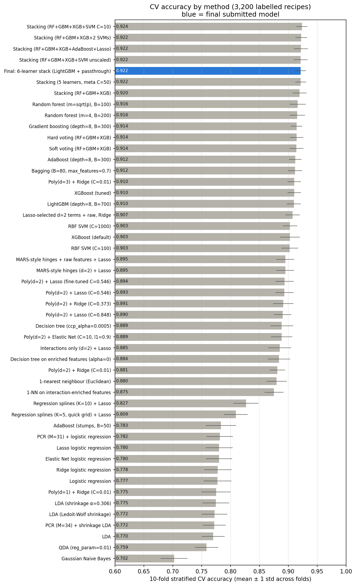
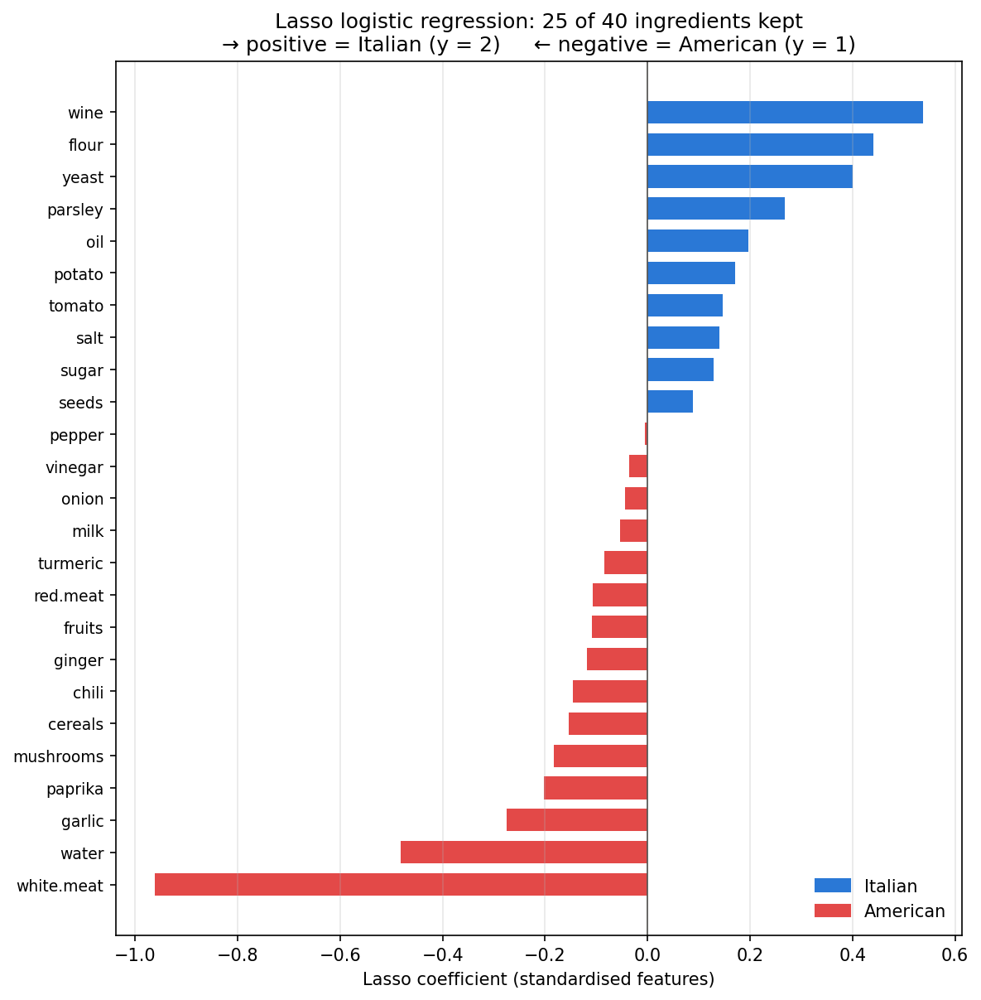
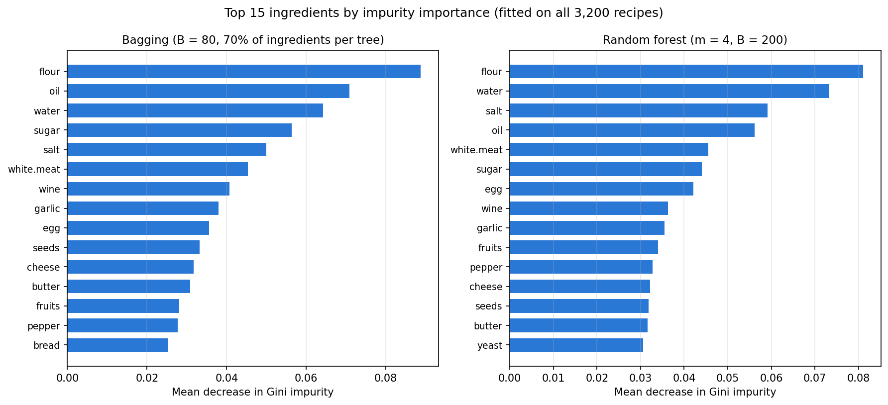
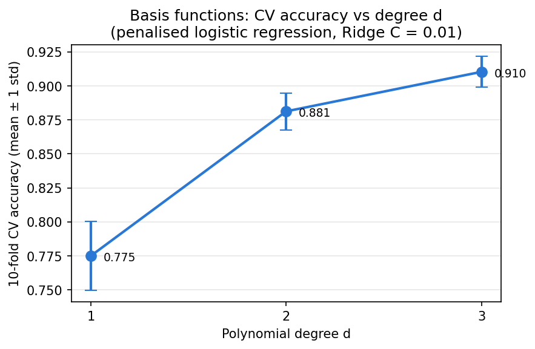

# Italian or American? Classifying Recipes from Ingredient Profiles

A supervised-learning study in Python: predict whether a recipe is **Italian** or **American** from 40 TF-IDF ingredient scores. More than fifteen methods from the statistical-learning toolkit are compared under a common cross-validation protocol, moving from linear baselines to basis expansions, trees, boosting, SVMs and a stacked ensemble. The ingredient patterns that separate the two cuisines are read from the fitted models.

> **Status:** completed individual project (final data challenge of an MSc Machine Learning course, Bocconi University, 2026). See [Evaluation note](#evaluation-note) and [Disclaimer](#disclaimer).
>
> **Related projects:** [StockTwits attention factor](https://github.com/ceciliaalocicero/stocktwits-attention-factor) · [CAPM tests](https://github.com/ceciliaalocicero/capm-empirical-tests-sp500) · [Markowitz out-of-sample](https://github.com/ceciliaalocicero/markowitz-out-of-sample-test)

---

## Problem

- **Data:** 4,934 recipes, each described by 40 ingredient features (salt, sugar, flour, oil, wine, tomato, pasta, cheese, white meat, and so on).
- **Features:** each feature is a TF-IDF score, x<sub>ij</sub> = TF<sub>ij</sub> × log(4934 / n<sub>j</sub>). The 3,200 training recipes are labelled (1 = American, 2 = Italian; balanced, 1,648 vs 1,552); 1,734 test recipes are unlabelled.
- **Metric:** number of misclassified test recipes (symmetric 0–1 cost).

## Key findings

| # | Finding | Evidence (10-fold stratified CV on 3,200 recipes) |
|---|---------|----------------------|
| 1 | **Linear models plateau at about 78% accuracy.** Logistic regression, Lasso, Ridge, Elastic Net, LDA (with or without shrinkage) and PCR all land between 77% and 78.2%; QDA (76%) and Naive Bayes (70%) do worse. | Tuned C, α, M by CV |
| 2 | **Ingredient interactions are the key structure.** A degree-2 polynomial basis with a Lasso penalty jumps to 89.3% (860 features); degree 3 with Ridge reaches 91.0%. Per-ingredient splines help much less (82.7%). | Poly / spline / hinge bases + penalised logistic regression |
| 3 | **Tree ensembles and boosting do best among single models.** Random forest 91.6% (m = 4, B = 200), gradient boosting 91.4%, AdaBoost (depth-8 trees) 91.2%, bagging 91.2%, XGBoost 91.0%. | Grid search over depth, m, B, learning rate |
| 4 | **Half of the recipes are exact duplicates.** 52.5% of training recipes share their feature vector with another training recipe, 53.6% of test recipes match a training recipe, and 50.7% of CV validation rows have an exact copy in their training folds. This is why a 1-nearest-neighbour classifier already reaches 88.0%, and it means CV accuracy partly measures recall of seen recipes. | Exact-match counts on the feature vectors |
| 5 | **Stacking adds a small gain.** The stacked ensembles reach 91.97%–92.38%, against 91.6% for the best single model. Their differences (≤ 0.4 pp) are well below the fold standard deviation (about 1 pp); the highest is RF + gradient boosting + XGBoost + one scaled RBF SVM (92.38%). | 5-fold out-of-fold stacking inside 10-fold CV |
| 6 | **What separates the cuisines (Lasso, 25 of 40 ingredients kept).** Italian: wine, flour, yeast, parsley, oil, tomato. American: white meat, water, garlic, paprika, mushrooms. In both tree ensembles, flour, oil, water and salt are among the five most-used split variables; cheese, butter and egg are used by the trees but set to zero by the Lasso. | L1 logistic coefficients; bagging and random-forest Gini importance |

**The final submitted model** is a six-learner stacked ensemble (random forest, gradient boosting, XGBoost, LightGBM and two RBF SVMs, with a logistic meta-learner and the raw features passed through). Its 10-fold CV accuracy is **92.16% (± 0.92 pp across folds)**, the same as the five-learner stack without LightGBM and passthrough. It ranked with **43 misclassifications** on the course leaderboard (see the evaluation note).

---

## Selected results

**CV accuracy by method**



**Lasso logistic regression: coefficients of the 25 retained ingredients**



**Ingredient importance in the tree ensemble**



**Interactions matter: CV accuracy vs polynomial degree**



---

## Methodology

**Protocol.** Stratified 10-fold CV with seed 42 for model comparison. Some exploratory grids (KNN, decision trees, bagging, MARS-style hinges, the quick spline grid, and the random-forest leaf/split/criterion grid) use 5-fold CV for speed; this is noted in the notebook, and every chosen model is then evaluated once with the common 10-fold CV. For most models, preprocessing (scaling, PCA, basis expansion) sits inside scikit-learn pipelines so that it is fitted within each fold. Three derived feature sets (the interaction-enriched matrix, the hinge basis and the Lasso-selected degree-2 terms) were scaled, and in the last case selected, on all 3,200 recipes before CV; their CV accuracies are therefore slightly optimistic.

| Family | Methods | Tuned by CV |
|--------|---------|-------------|
| Linear | Logistic regression; Lasso, Ridge, Elastic Net | C = 1/λ, l1_ratio |
| Discriminant analysis | LDA, shrinkage LDA (Ledoit–Wolf and grid), QDA, Gaussian Naive Bayes | shrinkage α, QDA regularisation |
| Dimension reduction | PCA + logistic regression / LDA (PCR) | number of components M |
| Basis expansions | Polynomial (d = 1–3, with or without interactions), regression splines, MARS-style hinge functions, each with penalised logistic regression | degree, knots, C |
| Local methods | k-nearest neighbours (Euclidean, Manhattan, cosine) | k, metric |
| Trees | Decision tree (depth, cost-complexity pruning), bagging, random forest | depth, α, B, m, max_features |
| Boosting | AdaBoost, gradient boosting, XGBoost, LightGBM | AdaBoost and XGBoost: depth, B, learning rate, subsampling, L1/L2 (gradient boosting and LightGBM use fixed settings) |
| Kernel methods | SVM with RBF kernel (base learners of the stacks) | not tuned (C = 100 and 1000) |
| Ensembles | Hard and soft voting; stacking with a logistic meta-learner | base-learner set, meta C, passthrough |

**Methods beyond the course syllabus.**
- **XGBoost:** gradient boosting with a second-order approximation of the loss and L1/L2 penalties on leaf weights.
- **LightGBM:** histogram-based gradient boosting that grows trees leaf-wise, splitting the leaf with the largest loss reduction.

Both are described in the notebook.

---

## Evaluation note

Two kinds of numbers appear in this project, and they are **not comparable**:

- **Cross-validation accuracy** on the 3,200 labelled recipes. This is the main metric here: it is fully reproducible and was used to compare methods.
- **Course leaderboard errors** (for example 175 for logistic regression, 43 for the final ensemble). These counts are consistently between about one-third and one-half of what the CV error rates imply for 1,734 recipes (about 45% for logistic regression, 175 vs 386; about 32% for the final ensemble, 43 vs 136). That pattern is consistent with the leaderboard scoring only part of the test set. [Confirm: the leaderboard scored N of the 1,734 test recipes.] So leaderboard counts should **not** be read as accuracy on all 1,734 test recipes.

Several design choices (for example the final ensemble composition) were partly guided by leaderboard feedback, so the leaderboard score is an optimistic estimate of performance on new data. CV accuracy is the more reliable guide.

## Repository structure

```
recipe-cuisine-classifier/
├── README.md
├── LICENSE
├── requirements.txt
├── .gitignore
├── notebooks/
│   └── recipe_cuisine_classification.ipynb   # full analysis, executed top to bottom
├── figures/                                  # charts exported from the notebook
├── data/
│   └── README.md                             # data description (data not included)
└── references/
    └── README.md
```

## Technologies

Python · pandas · NumPy · scikit-learn · XGBoost · LightGBM · Matplotlib · Jupyter

## Reproducing the analysis

```bash
git clone https://github.com/ceciliaalocicero/recipe-cuisine-classifier.git
cd recipe-cuisine-classifier
python -m venv .venv
.venv\Scripts\activate          # macOS/Linux: source .venv/bin/activate
pip install -r requirements.txt
```

1. Place `train.csv` and `test.csv` in `data/raw/` (see [`data/README.md`](data/README.md)).
2. Open `notebooks/recipe_cuisine_classification.ipynb` and run all cells. All seeds are fixed at 42.
3. Exhaustive hyperparameter searches are switched off by default (`RUN_FULL_SEARCH = False`); the selected hyperparameters are hard-coded. Set the flag to `True` to repeat the searches (several hours on a laptop). With the flag off, the full notebook runs in about 20 minutes on an 8-core laptop.

## Limitations

- CV accuracies were estimated on the same folds used for tuning, so they are slightly optimistic. Nested CV would remove this bias.
- About half of the recipes are exact duplicates of other recipes (see key finding 4), so CV accuracy partly measures recall of recipes already seen in training. Grouping duplicates into the same fold would give a stricter estimate.
- Three derived feature sets were scaled or selected on all training recipes before CV (see Methodology).
- Model choices were partly informed by leaderboard feedback (see the evaluation note).
- An earlier, unsaved notebook session reported 92.75% for the five-learner stack. That value cannot be reproduced from the saved code, which gives 92.16%; only reproducible values are reported here.
- TF-IDF scores were computed by the course on all 4,934 recipes. The 40 features are aggregated ingredient groups (for example "oil", not a specific oil), which limits interpretation.
- Lasso coefficients describe associations in a regularised linear model. An ingredient set to zero is not necessarily irrelevant: cheese, butter and egg are set to zero by the Lasso but are among the 15 most-used split variables in the tree ensembles.

## Author

**Cecilia Lo Cicero** (individual project).

## References

- James, G., Witten, D., Hastie, T., & Tibshirani, R. (2021). *An Introduction to Statistical Learning* (2nd ed.). Springer.
- Hastie, T., Tibshirani, R., & Friedman, J. (2009). *The Elements of Statistical Learning* (2nd ed.). Springer.
- Breiman, L. (2001). Random forests. *Machine Learning*, 45(1), 5–32.
- Wolpert, D. H. (1992). Stacked generalization. *Neural Networks*, 5(2), 241–259.
- Chen, T., & Guestrin, C. (2016). XGBoost: A scalable tree boosting system. *KDD '16*, 785–794.
- Ke, G., et al. (2017). LightGBM: A highly efficient gradient boosting decision tree. *NeurIPS 30*.
- Ledoit, O., & Wolf, M. (2004). A well-conditioned estimator for large-dimensional covariance matrices. *Journal of Multivariate Analysis*, 88(2), 365–411.
- Friedman, J. H. (1991). Multivariate adaptive regression splines. *Annals of Statistics*, 19(1), 1–67.

## Disclaimer

Educational project. The dataset was provided for coursework and is not redistributed here.

## License

Code is released under the [MIT License](LICENSE). Data are not included.
